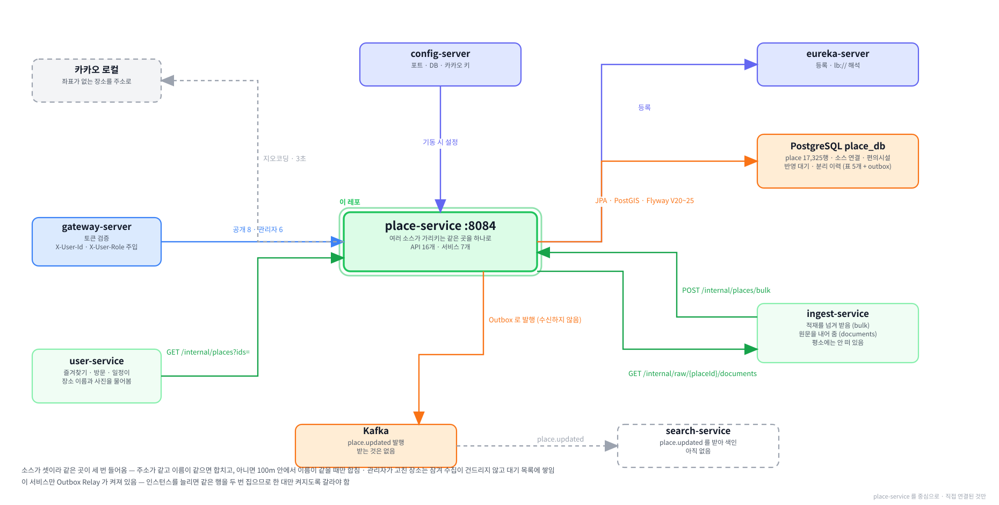

# place-service

**함께하개**는 반려동물과 함께 갈 수 있는 장소를 찾고, 우리 아이가 그곳에
들어갈 수 있는지 판정해 주는 서비스입니다.

이 저장소는 그중 **장소를 맡는 서버**입니다.
여러 기관이 따로따로 공개한 자료를 받아 **같은 곳을 하나로 합쳐** 들고 있습니다.

---

**먼저 전체 그림을 보고, 이 레포가 그 안 어디에 있는지 본 뒤 읽습니다.**

**① 전체 구조 — 층으로 본 것.** 위에서 아래로 요청이 내려가고, 어느 층에 무엇이 있는지.


**② 전체 구조 — 서비스끼리 무엇을 주고받는지.** 초록 실선이 `/internal` 호출, Kafka 표가 이벤트, 하늘색 점선이 VPC 경계.


**③ 이 레포를 중심으로.** 직접 연결된 것만 남긴 그림.



<br><br>

---

## 본문 시작

<br><br>

---

## 0. 이 서비스가 하는 일

### 0-1. 한 문장

```
공공데이터포털 ──┐
                 │                         ┌──▶  user 가 카드에 씀
문화정보원 CSV ──┼──▶  ingest  ──▶  place ─┤
                 │                  (이 레포) └──▶  search 가 색인함
행정안전부 ──────┘                           │
                                             └──▶  화면이 상세로 보여줌
```

**받은 자료를 장소 하나로 합쳐 들고 있는 곳입니다.**
조건 문장을 읽어 내는 일도, 이 개가 들어갈 수 있는지 답하는 일도 다른 서비스가 합니다.

---

### 0-2. 다른 서비스와의 자리

```
받아 오기      ingest        공공데이터를 원본 그대로 담음
합치기         place         ← 이 레포.  같은 곳을 하나로
해석하기       extract       "목줄 착용" 같은 문장에서 조건을 뽑음
판정하기       verdict       "이 개를 데려갈 수 있는가" 를 답함
보여주기       search · user · review …
```

| | 이 서비스가 | |
|---|---|---|
| 하는 것 | 소스가 가리키는 같은 곳을 합치고, 이름과 주소를 다듬고, 관리자가 고칠 길을 엶 | |
| 안 하는 것 | 바깥 API 호출 | 지오코딩 하나만 예외 |
| | 조건 문장 해석 | `extract` 몫 |
| | 판정 | `verdict` 몫 |
| | 검색 | `search` 몫. 이 서비스는 식별자로만 찾음 |

---

### 0-3. 무엇이 들어 있나

```
place_db
  place                 17,325행     장소 본체
  place_source_link     17,472행     어느 소스의 어느 레코드에서 왔는지
  place_facility                     주차 · 산책로 · 놀이터 · 예약
  place_pending_update               잠긴 장소에서 수집이 발견한 값
  place_source_detach                관리자가 잘못 묶인 것을 떼어낸 기록
  + outbox                           공통 대역
```

**연결이 장소보다 많습니다.** 소스 셋이 같은 곳을 가리켜 합쳐진 곳이 147군데 있습니다.

---

### 0-4. 다섯 가지만 기억하면 됩니다

**① 소스가 셋이고 같은 곳이 세 번 들어옵니다**

```
PET_TOUR      한국관광공사 반려동물 동반여행    1,079건
GOCAMPING     한국관광공사 고캠핑             2,993건
CULTURE_CSV   한국문화정보원 문화시설         13,408건
                                        ─────────
                                    합계  17,480건  →  장소 17,325곳
```

**② 합칠지 말지를 규칙으로 정합니다**

```
주소가 같고 이름이 같다        →  합침
100m 안이고 이름이 같다        →  합침
이름만 같다                   →  ⛔합치지 않음
```

**③ 관리자가 고친 장소는 잠깁니다**

수집이 그 장소를 더 이상 건드리지 않고, 발견한 값은 대기 목록에 쌓습니다.

**④ 원본은 이 서비스에 없습니다**

「근거 원문 전체 보기」는 `ingest` 에 물어 옵니다. 우리는 합친 결과만 들고 있습니다.

**⑤ 이벤트를 보내기만 합니다**

`place.updated` 를 발행하고 받는 것은 없습니다. `search` 가 그것으로 색인을 다시 세웁니다.

---

### 0-5. 화면에서 어디에 쓰이나

| 화면 | 부르는 것 |
|---|---|
| 장소 상세 | `GET /api/v1/places/{placeId}` |
| 근거 원문 전체 보기 | `GET /api/v1/places/{placeId}/documents` |
| 즐겨찾기 · 방문 · 일정 카드 | `user` 가 `GET /internal/places?ids=` 로 대신 물음 |
| 관리자 — 장소 수정 | `PATCH /api/v1/admin/places/{placeId}` |
| 관리자 — 수집 대기 목록 | `GET /api/v1/admin/places/pending` |
| 관리자 — 이벤트 재발행 | `GET /api/v1/admin/places/outbox` |

⛔**검색 화면은 이 서비스를 부르지 않습니다.** `search` 가 자기 색인으로 답합니다.

<br><br>

---
## 1. 로컬에서 띄우기

### 1-1. 전체 흐름

```
① 인프라 컨테이너를 띄움        postgres · config-server · eureka-server
② 설정이 내려오는지 확인         config-server 가 place-service.yml 을 읽어야 함
③ 환경변수 셋을 넣고 실행        DB_HOST · SERVICE_DB_PASSWORD · KAKAO_REST_API_KEY
④ 떴는지 확인                  actuator + 유레카 등록
⑤ 데이터가 있는지 확인          없으면 ingest 가 넣어 줌
```

---

### 1-2. ① 인프라 컨테이너

```powershell
cd C:\Tour_Prj\infra
docker compose up -d
docker ps --format "{{.Names}}`t{{.Status}}"
```

이 셋이 `(healthy)` 여야 합니다.

| 컨테이너 | 왜 필요한가 |
|---|---|
| `pawtrail-postgres` | `place_db` 가 여기 있습니다 |
| `pawtrail-config-server` | 포트·DB·카카오 키가 전부 여기서 내려옵니다 |
| `pawtrail-eureka-server` | 다른 서비스를 이름으로 찾을 때 씁니다 |

`pawtrail-kafka` 도 함께 뜨는데, 없어도 기동은 됩니다.
다만 `place.updated` 가 나가지 못하고 회수 스케줄러가 실패를 쌓습니다.

---

### 1-3. ② 설정 확인

```powershell
curl.exe -s "http://localhost:8888/place-service/local" | Select-String "8084"
```

`"server.port":8084` 가 보여야 합니다. 안 보이면 이 순서로 봅니다.

```
① config-server 가 떴나          docker ps
② 저장소에 파일이 있나            paw-trail/config 의 place-service.yml
③ 캐시가 낡았나                  docker compose restart config-server
```

---

### 1-4. ③ 실행 구성

IntelliJ 의 Run/Debug Configurations → Environment variables 에 `;` 로 이어 넣습니다.

```
DB_HOST=localhost
SERVICE_DB_PASSWORD=<infra/.env 의 값>
KAKAO_REST_API_KEY=<카카오 개발자 콘솔의 REST API 키>
```

| 값 | 없으면 |
|---|---|
| `DB_HOST` | ⛔`UnknownHostException: ${DB_HOST}` 로 기동 실패 |
| `SERVICE_DB_PASSWORD` | 인증 실패. 설정 1계층이 이 값을 요구합니다 |
| `KAKAO_REST_API_KEY` | 기동은 되고 **좌표 보완만 조용히 실패**합니다 |

> ⚠**`infra/.env` 는 컨테이너용이라 IntelliJ 실행에는 안 읽힙니다.**
> 같은 값을 실행 구성에도 넣어야 합니다.

---

### 1-5. ④ 떴는지 확인

```powershell
curl.exe -s "http://localhost:8084/actuator/health" | ConvertFrom-Json | Select-Object status
```

⛔**`UP` 하나만 보고 끝내지 마십시오.**

```
유레카 컴포넌트가 UNKNOWN 이면 전체 판정에서 빠짐
→ 등록에 실패해도 UP 으로 보임
→ 다른 서비스가 이 서비스를 못 찾는데 원인이 안 드러남
```

등록까지 확인합니다.

```powershell
curl.exe -s "http://localhost:8761/eureka/apps/PLACE-SERVICE" -H "Accept: application/json" `
  | ConvertFrom-Json | ForEach-Object { $_.application.instance } | Select-Object hostName, status
```

`status` 가 `UP` 이어야 합니다. 기동 직후에는 30초쯤 걸립니다.

---

### 1-6. ⑤ 데이터 확인

```powershell
docker exec pawtrail-postgres psql -U pawtrail -d place_db -c "select count(*) from place"
```

| 결과 | 뜻 |
|---|---|
| 17,325 | 적재본이 들어 있습니다. 바로 씁니다 |
| 0 | 비어 있습니다. 아래를 봅니다 |

**비어 있으면 `ingest` 가 넣어 줍니다.**

```
① ingest 를 띄움                IntelliJ 또는 compose 의 pipeline 프로파일
② 수집을 먼저 돌림               소스별로 FULL
③ 넘기기를 돌림                 소스별로 LINK
```

```powershell
# ③ 넘기기만 하는 경우 (raw_db 에 이미 자료가 있을 때)
$body = "$env:TEMP\pt-trigger.json"
Set-Content -Path $body -Encoding utf8NoBOM -Value '{"source":"CULTURE_CSV","runType":"LINK"}'
curl.exe -s -X POST "http://localhost:8088/internal/ingest/trigger" `
  -H "Content-Type: application/json" -d "@$body"
```

| 소스 | 건수 | 걸리는 시간 |
|---|---|---|
| `PET_TOUR` | 1,079 | 20초쯤 |
| `GOCAMPING` | 2,993 | 1분쯤 |
| `CULTURE_CSV` | 13,408 | 5분 남짓 |

> ⛔**`ingest` 와 이 서비스를 같은 곳에서 띄우십시오.**
> 한쪽이 컨테이너이고 한쪽이 IntelliJ 이면 서로 못 찾습니다. [11-5](#11-5-컨테이너와-intellij-를-섞으면-서로-못-찾습니다) 참고.

---

### 1-7. 바로 불러 보기

게이트웨이를 거치지 않고 8084 로 직접 부릅니다. 토큰 대신 헤더만 넣으면 됩니다.

```powershell
$ah = @("-H", "X-User-Id: 00000000-0000-7000-8000-00000000000a", "-H", "X-User-Role: USER")

# 장소 하나 뽑기
$id = (docker exec pawtrail-postgres psql -U pawtrail -d place_db -t -A `
  -c "select id from place limit 1").Trim()

# 상세
curl.exe -s @ah "http://localhost:8084/api/v1/places/$id" | ConvertFrom-Json | ForEach-Object { $_.data }
```

| 헤더 | |
|---|---|
| `X-User-Id` | 게이트웨이가 토큰을 풀어 넣어 주는 값입니다. 직접 부를 때는 손으로 넣습니다 |
| `X-User-Role` | 관리자 API 를 부를 때는 `ADMIN` 이어야 합니다 |

⛔**`/internal` 은 게이트웨이가 라우팅하지 않습니다.** 8084 로만 부를 수 있습니다.

<br><br>

---
## 2. ⛔같은 곳이 세 번 들어옵니다

**이 서비스가 있는 이유입니다.** 이 장을 안 읽으면 나머지가 왜 그렇게 생겼는지 알 수 없습니다.

---

### 2-1. 기관 셋이 따로따로 공개했습니다

```
한국관광공사     반려동물 동반여행정보      1,079건
한국관광공사     고캠핑                   2,993건
한국문화정보원   반려동물 동반 문화시설    13,408건
                                     ─────────
                                합계  17,480건
```

서로 약속하고 만든 것이 아니라 **같은 장소가 여러 곳에 들어 있습니다.**

---

### 2-2. 실제로 이렇게 생겼습니다

문암생태공원 한 곳을 소스 셋이 각각 이렇게 말합니다.

| | 한국관광공사 | 고캠핑 | 문화정보원 |
|---|---|---|---|
| 이름 | 문암생태공원 | 문암생태공원 | 문암생태공원 |
| 동반 여부 | 일부구역 동반가능 | **불가능** | Y |
| 조건 | 맹견 제외 · 입마개 · 목줄 | — | 목줄 · 배변봉투 |
| 기준일 | 2025-09-16 | 2025-09-26 | **2022-11-30** |

⛔**셋이 서로 다르게 말합니다.** 기준일도 3년 가까이 벌어져 있습니다.

```
합치지 않으면    사용자가 검색 결과에서 같은 공원을 세 번 봄
                어느 것이 맞는지 알 수 없음
합치기만 하면    우리가 고른 값만 보이고 나머지가 사라짐
                "왜 불가능이라고 안 알려줬지" 가 됨
```

**그래서 합치되 원본을 버리지 않습니다.** 「근거 원문 전체 보기」가 그 자리입니다.

---

### 2-3. 소스마다 주는 것이 다릅니다

```
              PET_TOUR   GOCAMPING   CULTURE_CSV
이름              ✅          ✅            ✅
도로명 주소        ✅          ✅         84%
지번 주소          ⛔          ⛔            ✅
좌표              ✅          ✅         대부분
전화번호        상세에만       ✅            ✅
소개문            ✅          ✅            ✅
운영시간           ✅          ⛔            ✅
휴무일            ✅          ⛔            ✅
사진              ✅          ✅            ⛔
예약 주소          ⛔          ✅            ⛔
편의시설           일부         ✅          주차만
```

**한 소스만으로는 칸이 비는 곳이 많습니다.** 합치면 서로의 빈칸을 메웁니다.

---

### 2-4. 이름이 같아도 다른 곳일 수 있습니다

```
스타벅스 강남점        서울에 하나
스타벅스 강남점        부산에도 있을 수 있음
```

```
문암생태공원          충북 청주
문암생태공원 캠핑장    같은 자리.  이름이 조금 다름
```

⛔**이름만 보고 합치면 안 되고, 이름이 다르다고 무조건 다른 곳도 아닙니다.**
그래서 [3장](#3-어떻게-하나로-합치는가) 의 규칙이 필요합니다.

---

### 2-5. 소스가 준 값이 깨끗하지 않습니다

실제로 겪은 것들입니다.

| 무엇 | 실물 | 어떻게 했나 |
|---|---|---|
| 시도 이름 | `강원도` 와 `강원특별자치도` 가 섞임 | 표준 이름으로 통일 |
| 지번에 필지 | `두운리 1026외 2필지` | 그대로 둠. 두 건뿐이라 규칙을 만들 값어치가 없음 |
| 홈페이지 | `<a href="…">바로가기</a>` 통째로 | 주소만 뽑음 |
| 좌표 | 위도와 경도가 뒤바뀐 행 | 대한민국 범위로 검사 |
| 좌표 없음 | 문화정보원 일부 | 주소로 지오코딩 |
| 문자열 `"null"` | 값 자리에 그 네 글자 | 빈 값으로 봄 |

**[4장](#4-무엇을-어떻게-담는가) 이 이것들을 다룹니다.**

<br><br>

---
## 3. 어떻게 하나로 합치는가

### 3-1. 전체 흐름

```
소스 레코드 하나가 들어옴
   │
   ├─① 이미 붙은 적 있나          (source, source_id) 로 찾음
   │     있으면 → 그 장소를 갱신하고 끝
   │
   ├─② 관리자가 떼어낸 적 있나     분리 이력을 봄
   │     있으면 → 그 장소는 후보에서 뺌
   │
   ├─③ 주소로 찾기                정규화 주소가 같은 것 중 이름이 같은 것
   │     찾으면 → 합침
   │
   ├─④ 좌표로 찾기                반경 안에서 이름이 같은 것
   │     찾으면 → 합침
   │
   └─⑤ 못 찾음                    새 장소를 만듦
         좌표도 주소도 없으면 → 건너뜀
```

---

### 3-2. ① 이미 붙은 것은 다시 판정하지 않습니다

```sql
UNIQUE (source, source_id)     place_source_link
```

| | |
|---|---|
| 무엇을 보장하나 | 같은 레코드를 여러 번 밀어 넣어도 장소가 늘지 않습니다 |
| 왜 중요한가 | `ingest` 가 넘기기를 몇 번 돌려도 `place_id` 가 그대로입니다 |
| 실물 | 17,480건을 두 번 보냈는데 장소 수가 한 건도 안 늘었습니다 |

⛔**이 제약이 없으면 다시 돌릴 때마다 장소가 배로 늘어납니다.**

---

### 3-3. ③ 주소로 찾기

```
정규화 주소가 같은 것을 모음   →   그중 이름이 같은 것이 있으면 합침
```

**주소를 그대로 비교하지 않습니다.** 같은 곳인데 글자가 다릅니다.

```
강원도 양양군 현북면 하조대해안길 35
강원특별자치도 양양군 현북면 하조대해안길 35
                    ↓ 정규화
강원|양양군현북면하조대해안길35        둘 다 같은 값이 됨
```

| 단계 | 하는 일 |
|---|---|
| 시도 표준화 | `강원도` · `강원특별자치도` → `강원` |
| 공백 제거 | 띄어쓰기가 소스마다 다름 |
| 막대로 구분 | 시도와 나머지를 갈라 둠 |
| 지번 폴백 | 도로명이 없으면 지번으로 |

⛔**도로명이 없는 행이 있습니다.** 문화정보원 16% 가 그렇습니다.

---

### 3-4. ④ 좌표로 찾기

주소가 다르게 적혀 정규화로 안 잡히는 경우입니다.

```
후보를 300m 반경으로 모음
   │
   └─ 그중 이름이 같은 것마다
        ├─ 둘 다 원본 좌표      →  100m 안이면 합침
        └─ 한쪽이 지오코딩 좌표  →  300m 안이면 합침
```

| 임계값 | 값 | 왜 |
|---|---|---|
| 원본끼리 | **100m** | 소스마다 대표 좌표를 다르게 잡습니다. 건물 중심을 쓰는 곳과 입구를 쓰는 곳이 있어 주소와 이름이 같은데 좌표만 100m 가까이 떨어진 쌍이 실제로 있습니다 |
| 지오코딩이 끼면 | **300m** | 주소를 좌표로 바꾼 값이라 원본보다 오차가 큽니다 |
| 후보 반경 | **300m** | 넓은 쪽으로 고정합니다 |

⛔**후보 반경을 넓은 쪽으로 고정한 이유가 있습니다.**

```
새 레코드의 좌표 출처만 보고 반경을 정하면
  새 레코드가 원본 · 기존 장소가 지오코딩인 쌍은 300m 까지 봐야 하는데
  100m 로 조회하면 후보로 올라오지도 않음
  반대 순서로 들어오면 잡힘

→ 같은 쌍이 어느 쪽이 먼저 들어왔느냐로 결과가 달라짐
```

넓게 받아도 거짓 병합이 늘지 않습니다. 판정이 두 장소의 좌표 출처를 보고 실제 임계값을 다시 적용합니다.

---

### 3-5. 이름이 같다는 것은 무슨 뜻인가

```
공백만 지우고 완전히 같아야 함
```

| | |
|---|---|
| 같다고 보는 것 | `문암 생태공원` 과 `문암생태공원` |
| ⛔다르다고 보는 것 | `문암생태공원` 과 `문암생태공원 캠핑장` |
| ⛔포함 관계를 안 봅니다 | `스타벅스` 가 `스타벅스 강남점` 을 삼켜 버립니다 |

**괄호 안은 별칭으로 따로 둡니다.**

```
하조대해수욕장(하조대)
     ↓
이름       하조대해수욕장(하조대)
정규화     하조대해수욕장(하조대)
별칭       하조대 · 하조대해수욕장
```

---

### 3-6. ⑤ 못 찾으면 새로 만듭니다

**다만 좌표가 없으면 못 만듭니다.** 컬럼이 `NOT NULL` 입니다.

```
소스가 준 좌표가 대한민국 안인가
   │
   ├─ 예      →  그대로 씀
   │
   ├─ 아니오  →  합칠 상대가 있으면 그 좌표를 물려받음
   │           없으면 주소로 지오코딩
   │
   └─ 그래도 없으면  →  ⛔건너뜀
```

| 실물 | |
|---|---|
| 지오코딩으로 살린 것 | 7건 |
| 끝내 건너뛴 것 | **8건** |
| 어느 소스인가 | 고캠핑. 좌표도 주소도 없었습니다 |

건너뛴 것은 응답의 `skipped` 로 드러납니다. 조용히 사라지지 않습니다.

---

### 3-7. 합칠 때 무엇을 가져오나

```
빈 칸만 채웁니다.  이미 값이 있으면 안 덮어씁니다.
```

| 규칙 | 왜 |
|---|---|
| 빈 칸만 채움 | 먼저 들어온 값이 이기는 것이 아니라, **덮어쓰면 그 값이 어디서 왔는지 알 수 없어집니다** |
| 이름은 안 바꿈 | 이름이 갈리면 애초에 같은 장소로 보지도 않았을 것입니다 |
| 전화번호는 출처와 짝 | 번호만 채우고 출처를 안 채우면 어디서 온 값인지 모릅니다 |
| 편의시설은 지우고 다시 | 있다가 없어진 것도 반영해야 합니다 |

---

### 3-8. 실측 결과

```
받은 것            17,480건
장소가 된 것        17,325곳
   합쳐진 쌍          147
   건너뛴 것            8
```

| 소스 | 넘긴 것 | 붙은 것 |
|---|---|---|
| `CULTURE_CSV` | 13,408 | 13,408 |
| `GOCAMPING` | 2,993 | **2,985** |
| `PET_TOUR` | 1,079 | 1,079 |

고캠핑의 여덟 건 차이가 [3-6](#3-6-⑤-못-찾으면-새로-만듭니다) 의 건너뛴 것입니다.

<br><br>

---
## 4. 무엇을 어떻게 담는가

### 4-1. 한 장소에 담기는 것

```
place
  ├ 이름            name · name_normalized · name_alias
  ├ 분류            place_type          아홉 가지 중 하나
  ├ 주소            address_road · address_jibun · address_normalized · sido_code
  ├ 좌표            lat · lon · geom · coord_source
  ├ 연락            tel · tel_source · homepage · reservation_url
  ├ 내용            overview · business_hours · closed_days · image_url
  ├ 상태            status · admin_locked · supply_point
  └ 원본 보존       lcls1~3 · cpyrht_div_cd · data_base_date
```

**마지막 줄이 특별합니다.** 소스가 준 코드를 그대로 둡니다. 관리자도 못 고칩니다.

---

### 4-2. 이름 — 세 칸으로 나눕니다

```
하조대해수욕장(하조대)
        │
        ├─ name              하조대해수욕장(하조대)      화면에 보이는 것
        ├─ name_normalized   하조대해수욕장(하조대)      합칠지 판단할 때 쓰는 것
        └─ name_alias        하조대 · 하조대해수욕장     검색이 쓸 다른 이름
```

| 칸 | 만드는 법 |
|---|---|
| `name` | 소스가 준 그대로 |
| `name_normalized` | 공백만 지움 |
| `name_alias` | 괄호 안의 말 + 괄호를 뗀 본명 |

⛔**소문자로 바꾸거나 특수문자를 지우지 않습니다.** 지점명이 사라지면 다른 지점과 합쳐집니다.

---

### 4-3. 주소 — 정규화 주소가 진짜 열쇠입니다

```
입력      강원특별자치도 양양군 현북면 하조대해안길 35
           │
           ├─ 시도 표준화     강원특별자치도 → 강원
           ├─ 공백 제거       양양군현북면하조대해안길35
           └─ 막대로 이음
           ↓
정규화    강원|양양군현북면하조대해안길35
시도코드   42
```

**시도 표준화가 필요한 이유입니다.**

| 소스 | 쓰는 이름 |
|---|---|
| 한국관광공사 | `강원특별자치도` · `전북특별자치도` |
| 문화정보원 | `강원도` · `전라북도` |

⛔**표준화를 안 하면 같은 곳이 영영 안 합쳐집니다.**

```
도로명이 없으면    지번으로 대신함
둘 다 없으면      정규화 주소가 null → 주소로는 못 찾음
```

> ⚠**`sigungu_code` 는 지금 전부 비어 있습니다.**
> 뽑는 함수가 없고 소스도 주지 않습니다. 매칭은 이 값을 안 봅니다.

---

### 4-4. 좌표 — 대한민국 안인지 봅니다

```
위도 33.0 ~ 38.7     경도 124.5 ~ 132.0
```

| 왜 검사하나 | |
|---|---|
| 위경도가 뒤바뀐 행 | `mapx` 와 `mapy` 중 어느 것이 위도인지 소스마다 다릅니다 |
| 0 · 빈 값 | 채우다 만 행이 있습니다 |
| 해외 좌표 | 잘못 입력된 것입니다 |

**범위 밖이면 없는 것으로 보고 지오코딩으로 넘어갑니다.**

```
coord_source
  ORIGINAL    소스가 준 좌표
  GEOCODED    주소를 카카오 로컬 API 로 바꾼 것
  INHERITED   합칠 상대의 좌표를 물려받은 것
```

이 값이 매칭 임계값을 가릅니다. [3-4](#3-4-④-좌표로-찾기) 참고.

**`geom` 은 자동으로 만들어집니다.** PostGIS 컬럼이고 `lat`·`lon` 이 바뀌면 엔티티가 다시 만듭니다.

---

### 4-5. 분류 — 아홉 가지로 좁힙니다

```
PARK  CAMPING  CAFE  STAY  CULTURE  LEISURE  RESTAURANT  VET  ETC
```

소스마다 분류 체계가 다릅니다.

| 소스 | 어디를 보나 |
|---|---|
| `PET_TOUR` | 관광공사 분류 코드의 **중분류** (`NA01` · `AC05` · `FD05` …) |
| `GOCAMPING` | ⛔안 봅니다. 야영장이라는 것이 이미 정해져 있습니다 |
| `CULTURE_CSV` | 카테고리3 을 **중분류 자리**에 담아 보냅니다 |
| `MOIS_VET` | 동물병원 |

```
NA01 · NA02 · VE02 · VE03 · EX03    →  PARK
AC01 · AC02 · AC03 · AC04 · VE05    →  STAY
AC05                                →  CAMPING
FD05 · FD02                         →  CAFE
FD01                                →  RESTAURANT
HS01~04 · VE04 · VE07               →  CULTURE
VE01 · EX02 · EX07 · LS…            →  LEISURE
그 밖                                →  ETC
```

⛔**문화정보원 값을 대분류 자리에 넣으면 전부 `ETC` 가 됩니다.** 넘기는 쪽이 자리를 맞춰 줘야 합니다.

---

### 4-6. 편의시설 — 네 가지만 봅니다

```
PARKING   WALKING_TRAIL   PLAYGROUND   RESERVATION
```

**소스가 자유 텍스트로 줍니다.** 형태가 제각각입니다.

```
주차 가능을 뜻하는 것
  가능 · 있음 · Y · 가능(무료) · 가능(10대 이상) · 가능<br>요금 (무료)

주차 불가를 뜻하는 것
  불가 · 불가능 · N
```

⛔**불가를 먼저 걸러야 합니다.**

```
"불가능" 안에 "가능" 이 들어 있음
→ 순서가 뒤집히면 주차 안 되는 곳이 된다고 나옴
```

**산책로는 두 필드를 합칩니다.**

| 필드 | 뜻 | 건수 |
|---|---|---|
| `posblFcltyCl` | 야영장 주변에 있는 것 | 1,247 |
| `sbrsCl` | 야영장이 갖춘 것 | 708 |

뜻이 미묘하게 다르지만 *"반려동물과 산책할 데가 있나"* 에는 둘 다 예스입니다.

⛔**어린이놀이시설은 놀이터로 안 칩니다.**

```
posblFcltyCl 의 "어린이놀이시설" 297건
→ 이름에 어린이가 명시돼 있어 묶으면 강아지 놀이터로 오해함
```

**예약은 온라인만 칩니다.** 전화와 현장은 온라인 예약이 아닙니다.

---

### 4-7. 잘린 값과 빈 값

```
길이를 넘기면      그 칸만 비움.  잘라 담지 않음
"null" 문자열      빈 값으로 봄
앵커 태그          주소만 뽑음
```

⛔**잘라 담지 않는 이유가 있습니다.**

```
주소를 잘라 담으면  →  그 장소가 주소 매칭에서 통째로 빠짐
전화번호를 자르면   →  사용자가 그 번호로 걺
```

**차라리 비우고 다음 소스가 채우게 둡니다.**

<br><br>

---
## 5. API 11개

### 5-1. 한눈에

```
공개      /api/v1/places/…            게이트웨이를 거쳐 사용자가 부름
관리자    /api/v1/admin/places/…      게이트웨이를 거치되 ADMIN 만
내부      /internal/places/…          ⛔게이트웨이가 라우팅하지 않음
```

| | 경로 | 누가 |
|---|---|---|
| 1 | `GET /api/v1/places/{placeId}` | 화면 — 장소 상세 |
| 2 | `GET /api/v1/places/{placeId}/documents` | 화면 — 근거 원문 전체 보기 |
| 3 | `PATCH /api/v1/admin/places/{placeId}` | 관리자 — 값 고치기 |
| 4 | `DELETE /api/v1/admin/places/{placeId}/sources/{sourceLinkId}` | 관리자 — 잘못 묶인 것 떼기 |
| 5 | `GET /api/v1/admin/places/pending` | 관리자 — 수집이 못 반영한 값 |
| 6 | `POST /api/v1/admin/places/pending/{id}/approve` | 관리자 — 승인 |
| 7 | `POST /api/v1/admin/places/pending/{id}/reject` | 관리자 — 반려 |
| 8 | `GET /api/v1/admin/places/outbox` | 관리자 — 멈춘 이벤트 |
| 9 | `POST /api/v1/admin/places/outbox/{id}/retry` | 관리자 — 다시 발행 |
| 10 | `GET /internal/places?ids=` | `user` — 카드에 쓸 이름과 사진 |
| 11 | `POST /internal/places/bulk` | `ingest` — 적재를 넘김 |

⛔**검색 API 가 없습니다.** `search` 가 자기 색인으로 답합니다. 이 서비스는 식별자로만 찾습니다.

---

### 5-2. `GET /api/v1/places/{placeId}` — 장소 상세

```json
응답   200
{
  "placeId": "01a09015-…",
  "name": "문암생태공원",
  "placeType": "PARK",
  "address": "충청북도 청주시 흥덕구 문암생태공원로 1",
  "lat": 36.6553,  "lon": 127.4602,
  "tel": "043-201-0732",
  "telSource": "PET_TOUR",
  "homepage": null,
  "reservationUrl": null,
  "imageUrl": "https://…",
  "overview": "문암생태공원은 …",
  "businessHours": "상시 개방",
  "closedDays": "연중무휴",
  "facilities": ["PARKING", "WALKING_TRAIL"],
  "supplyPoint": false,
  "status": "ACTIVE",
  "sources": [
    { "source": "PET_TOUR",    "sourceLabel": "한국관광공사" },
    { "source": "GOCAMPING",   "sourceLabel": "한국관광공사 고캠핑" },
    { "source": "CULTURE_CSV", "sourceLabel": "문화정보원" }
  ],
  "dataBaseDate": "2025-03-24"
}
```

| 필드 | 눈여겨볼 것 |
|---|---|
| `address` | 도로명이 있으면 도로명, 없으면 지번 |
| `telSource` | 그 번호를 어느 소스가 줬는지. 관리자가 고치면 `MANUAL` |
| `sources` | **소스가 여럿이면 여럿.** 화면의 출처 뱃지가 이 순서로 나옵니다 |
| `supplyPoint` | 급수대가 있는지. `pet` 이 쓰는 값입니다 |
| `dataBaseDate` | 소스가 밝힌 기준일 |

| 이런 때 | 응답 |
|---|---|
| 없는 식별자 | `404` `PLACE_NOT_FOUND` |
| 지워진 장소 | 같음 |
| 폐업한 장소 | ⛔`200`. 행을 안 지우고 `status` 를 `CLOSED` 로 둡니다 |

---

### 5-3. `GET /api/v1/places/{placeId}/documents` — 근거 원문 전체 보기

**이 서비스에 원본이 없습니다.** `ingest` 에 물어 옵니다.

```json
응답   200
{
  "documents": [
    { "source": "PET_TOUR",
      "sourceLabel": "한국관광공사",
      "title": "문암생태공원",
      "body": "[동반 유형] 일부구역 동반가능\n[동반 가능 반려동물] 맹견 제외 …",
      "sourceModifiedAt": "2025-09-16T15:31:47",
      "fetchedAt": "2026-09-09T14:22:57" }
  ]
}
```

| 필드 | |
|---|---|
| `sourceLabel` | ⛔`ingest` 는 코드값만 줍니다. **이 서비스가 붙입니다** |
| `title` | 소스가 부른 이름. 장소 이름과 다를 수 있고 그 차이가 정보입니다 |
| `body` | 사람이 읽는 문장만. 기계용 필드는 빠져 있습니다 |
| `sourceModifiedAt` | 소스가 밝힌 수정 시각. **소스마다 몇 해씩 갈립니다** |

| 이런 때 | 응답 |
|---|---|
| 없는 장소 | `404` `PLACE_NOT_FOUND`. ⛔`ingest` 를 아예 안 부릅니다 |
| 원문이 없음 | `200` 에 빈 목록 |
| `ingest` 를 못 부름 | `503` `PLACE_DOCUMENTS_UNAVAILABLE` |

⛔**빈 목록과 503 을 섞지 않습니다.**

```
원문이 정말 없는 것        MOIS_VET 만으로 만들어진 장소.  영영 없음
지금 못 가져오는 것        ingest 가 안 떠 있음

섞으면 사용자가 "이 장소는 근거가 없구나" 로 잘못 읽음
→ 이 화면이 있는 이유를 정면으로 훼손함
```

> ⚠**`ingest` 는 상시 기동이 아닙니다.** 개발 중 이 화면을 보려면 그것을 띄워야 합니다.

---

### 5-4. `PATCH /api/v1/admin/places/{placeId}` — 관리자 수정

```json
요청
{ "tel": "043-000-0000", "businessHours": null }
```

**보낸 것만 바꿉니다.** 안 보낸 칸은 그대로 둡니다.

```
키가 없음          그대로 둠
"필드": null       지움
"필드": "값"        바꿈
```

| 받는 것 11개 | |
|---|---|
| `name` · `addressRoad` · `addressJibun` | 파생값이 함께 다시 만들어집니다 |
| `tel` · `homepage` · `reservationUrl` · `imageUrl` | |
| `overview` · `businessHours` · `closedDays` | |
| `status` | 폐업 제보를 처리하는 자리입니다 |

⛔**안 받는 것**

```
place_type · lat · lon · supply_point     관리자 화면에 지도 편집기가 없어
                                          좌표를 숫자로 받으면 틀려도 못 알아챔
lcls1~3 · cpyrht_div_cd · data_base_date  소스가 준 것을 그대로 담는 자리라
                                          고치면 원문이 아니게 됨
편의시설                                   별도 표.  전용 경로로 열 자리
```

**주소는 덩어리입니다.**

```
도로명과 지번을 함께 보내야 함
한쪽만 보내면 400
지번이 없는 장소는 "addressJibun": null 로 명시
```

⛔**한쪽을 옛 값으로 채우지 않는 이유**

```
도로명을 부산으로 고쳤는데 지번에 강원도가 남으면
→ 정규화는 도로명을 먼저 보아 부산이 되고 지번만 거짓으로 남음
```

**고치면 그 장소가 잠깁니다.**

```
admin_locked = true
→ 수집이 그 장소를 더 이상 고치지 않음
→ 발견한 값은 반영 대기 목록에 쌓임
⛔잠금을 푸는 화면이 없음.  되돌리려면 데이터베이스를 직접 고쳐야 함
```

| 이런 때 | 응답 |
|---|---|
| 빈 본문 `{}` | `400`. 아무것도 안 바뀌면서 잠기기만 합니다 |
| `"name": null` | `400`. 이름은 지울 수 없습니다 |
| 주소 한쪽만 | `400` |
| 시도 없는 주소 | `400` `PLACE_ADDRESS_INVALID` |

---

### 5-5. `DELETE /api/v1/admin/places/{placeId}/sources/{sourceLinkId}` — 잘못 묶인 것 떼기

다른 곳인데 합쳐진 경우입니다.

```
연결 행만 지움.  본체 값은 그대로 둠
   │
   ├─ 뗀 것이 대표였으면  →  남은 것 중 하나를 대표로 올림
   ├─ 분리 이력에 남김    →  다음 수집에 다시 붙지 않게
   └─ place.updated 발행
```

⛔**경로의 값은 소스 이름이 아니라 연결 행의 식별자입니다.**

```
같은 소스가 한 장소에 둘 붙은 경우가 있음
→ 소스 이름으로는 어느 것을 뗄지 가릴 수 없음
```

| 이런 때 | 응답 |
|---|---|
| 소스가 하나뿐 | `409` `PLACE_LAST_SOURCE` |
| 그 장소의 연결이 아님 | `404` `PLACE_SOURCE_NOT_FOUND` |

**뗀 레코드는 다음 수집에 새 장소가 됩니다.** 관리자가 다른 곳이라고 판단했으므로 그것이 맞습니다.

---

### 5-6. 반영 대기 목록 — `pending` 셋

잠긴 장소에서 수집이 발견했지만 반영하지 못한 값입니다.

```
GET  /api/v1/admin/places/pending              처리할 것만
POST /api/v1/admin/places/pending/{id}/approve  place 에 반영
POST /api/v1/admin/places/pending/{id}/reject   place 는 그대로
```

```json
목록 응답   200
{
  "content": [
    { "pendingId": "01a096bc-…",
      "placeId": "01a09015-…",
      "placeName": "옥토끼우주센터",
      "fieldName": "tel",
      "currentValue": "032-937-6917",
      "newValue": "032-000-1111",
      "source": "PET_TOUR",
      "detectedAt": "2026-09-13T05:25:24" }
  ],
  "page": { "number": 0, "size": 20, "totalElements": 3, "totalPages": 1 }
}
```

| | |
|---|---|
| 담기는 것 | 처리 전인 것만. **비어 있는 것이 정상입니다** |
| 정렬 | 발견 시각 최신순 |
| 비교하는 칸 8개 | `name` · `address_road` · `address_jibun` · `tel` · `homepage` · `reservation_url` · `image_url` · `business_hours` |

**승인은 관리자 수정과 같은 경로를 탑니다.**

```
approve  →  PATCH 가 쓰는 그 메서드를 부름
         →  검증 · 파생값 재계산 · 잠금 · place.updated 가 전부 그 안에 있음
```

⛔**주소는 묶어서 승인됩니다.** 도로명을 승인하면 같은 장소의 지번 대기 값도 함께 처리됩니다.

**같은 값은 다시 쌓이지 않습니다.**

```
소스가 값을 고치지 않는 한 같은 차이가 수집마다 발견됨
→ 그때마다 행을 만들면 관리자가 같은 것을 계속 반려하게 됨
→ 데이터베이스 제약으로 막음
```

| 이런 때 | 응답 |
|---|---|
| 없는 대기 값 | `404` `PENDING_NOT_FOUND` |
| 이미 처리한 것 | `409` `PENDING_ALREADY_RESOLVED` |

---

### 5-7. 관리자 이벤트 재발행 — `outbox` 둘

```
GET  /api/v1/admin/places/outbox              멈춘 것만
POST /api/v1/admin/places/outbox/{id}/retry   다시 발행
```

**왜 필요한가.**

```
회수 스케줄러가 재시도 상한에 이르면 그 건을 조회에서 아예 뺌
  ⛔그러지 않으면 포기한 건이 같은 장소의 뒤 이벤트를 영영 막음
빠진 뒤로는 에러도 안 남음
  실패한 것이 아니라 대상이 아니게 된 것이라 아무도 다시 안 보냄
```

| 응답 필드 | |
|---|---|
| `id` · `eventId` · `topic` | 어느 이벤트인지 |
| `aggregateId` | 어느 장소인지 |
| `retryCount` · `lastError` | **지금 눌러도 되는 상황인지** 판단하는 재료 |

⛔**`payload` 를 담지 않습니다.** 다섯 서비스의 outbox 화면이 한곳에 모이므로 모양을 맞춥니다.

```
재발행에 성공해도 retryCount 를 안 되돌림
  →  "몇 번 실패한 뒤 사람이 보냈는지" 의 기록이 됨
실패하면 500 OUTBOX_REPUBLISH_FAILED
  →  성공으로 답하면 이 기능이 막으려던 상황 그 자체가 됨
```

---

### 5-8. `GET /internal/places?ids=` — 카드에 쓸 값

`user` 가 즐겨찾기·방문·일정 카드를 만들 때 부릅니다.

```json
응답   200
{ "places": [
    { "placeId": "01a09015-…", "name": "문암생태공원", "placeType": "PARK",
      "imageUrl": "https://…", "lat": 36.6553, "lon": 127.4602,
      "supplyPoint": false }
] }
```

| | |
|---|---|
| 상한 | **100개.** 넘으면 `400` |
| 없는 식별자 | ⛔결과에서 빠질 뿐. 오류가 아닙니다 |
| 왜 | 목록 하나가 실패하면 화면 전체가 비는 것보다 낫습니다 |

> ⚠**부르는 쪽이 100개씩 나눠야 합니다.** 즐겨찾기와 방문 기록에 페이징이 없어 101개부터 목록 전체가 실패합니다.

---

### 5-9. `POST /internal/places/bulk` — 적재 받기

`ingest` 가 부릅니다. **이 서비스의 데이터가 채워지는 유일한 경로입니다.**

```json
요청
{ "items": [
    { "source": "PET_TOUR", "sourceId": "125701",
      "name": "하조대해수욕장",
      "addressRoad": "강원특별자치도 양양군 현북면 하조대해안길 35",
      "addressJibun": null, "sidoName": "강원특별자치도",
      "lat": "38.0229894", "lon": "128.7242655", "coordSource": "ORIGINAL",
      "lcls1": "NA", "lcls2": "NA01", "lcls3": null,
      "tel": "033-672-2346", "homepage": null, "imageUrl": null,
      "cpyrhtDivCd": "Type1", "overview": null,
      "businessHours": null, "closedDays": null, "reservationUrl": null,
      "dataBaseDate": null,
      "parking": null, "posblFcltyCl": null, "sbrsCl": null, "resveCl": null }
] }
```

```json
응답   200
{ "created": 0, "merged": 1, "skipped": 0, "pending": 0, "pendingFailed": 0,
  "links": [
    { "source": "PET_TOUR", "sourceId": "125701", "placeId": "01a09015-…" }
  ] }
```

| 건수 | 뜻 |
|---|---|
| `created` | 새 장소가 됨 |
| `merged` | 이미 있는 장소에 붙음 |
| `skipped` | 좌표도 주소도 없어 못 만듦 |
| `pending` | 잠긴 장소라 대기 목록에 쌓음 |
| `pendingFailed` | 대기 행조차 못 만듦 |

| `links` | |
|---|---|
| 무엇 | 어느 소스 레코드가 어느 장소가 됐는지 |
| 누가 쓰나 | `ingest` 가 자기 표의 `place_id` 를 채웁니다 |
| 개수 | `created + merged`. **건너뛴 것은 안 담깁니다** |

| | |
|---|---|
| 상한 | **1,000개.** 넘으면 `400` |
| 좌표를 문자열로 받음 | 소수 열 자리가 오는 소스가 있어 실수로 받으면 정밀도가 흔들립니다 |
| 여러 번 보내면 | 같은 결과가 됩니다. 장소 수가 안 늘어납니다 |

---

### 5-10. 에러 코드

| 코드 | HTTP | 언제 |
|---|---|---|
| `PLACE_NOT_FOUND` | 404 | 없거나 지워진 장소 |
| `PLACE_SOURCE_NOT_FOUND` | 404 | 그 장소에 묶인 연결이 아님 |
| `PLACE_LAST_SOURCE` | 409 | 마지막 소스를 떼려 함 |
| `PLACE_ADDRESS_INVALID` | 400 | 시도를 못 알아보는 주소 |
| `PENDING_NOT_FOUND` | 404 | 없는 대기 값 |
| `PENDING_ALREADY_RESOLVED` | 409 | 이미 승인하거나 반려함 |
| `OUTBOX_REPUBLISH_FAILED` | 500 | 관리자가 누른 재발행이 실패 |
| `PLACE_DOCUMENTS_UNAVAILABLE` | 503 | `ingest` 를 못 부름 |

```
400 · 404 · 409    부르는 쪽이 고칠 수 있는 것
500                우리가 고칠 것
503                상대가 지금 없는 것
```

<br><br>

---
## 6. 데이터 — `place_db` 표 5개

### 6-1. 표끼리의 관계

```
place  (17,325)
  │
  ├──< place_source_link  (17,472)     어느 소스에서 왔는지.  한 장소에 여럿
  │
  ├──< place_facility                  주차 · 산책로 · 놀이터 · 예약
  │
  ├──< place_pending_update            잠긴 장소에서 발견한 값
  │
  └──< place_source_detach             관리자가 떼어낸 기록

outbox                                 공통 대역.  place.updated 가 쌓임
```

⛔**연결이 장소보다 많습니다.** 소스 셋이 같은 곳을 가리켜 합쳐진 곳이 147군데입니다.

---

### 6-2. `place` — 장소 본체

```
id                  uuid PK           UUID v7.  만든 순서가 곧 정렬 순서
name                varchar(200)      지점명을 포함해 폭이 넓음
name_normalized     varchar(200)      공백만 지운 것.  합칠지 판단할 때 씀
name_alias          text[]            괄호 안의 말 + 괄호를 뗀 본명
place_type          varchar(20)       아홉 가지
address_road        varchar(300)
address_jibun       varchar(300)      문화정보원만 줌
address_normalized  varchar(300)      시도|나머지.  ⛔매칭 일 순위 키
sido_code           char(2)           ⛔전부 비어 있지 않음.  아래 참고
sigungu_code        char(5)           ⛔전부 비어 있음
lat  lon            numeric(10,7)     NOT NULL
geom                geometry(Point)   PostGIS.  lat·lon 이 바뀌면 자동
coord_source        varchar(20)       ORIGINAL · GEOCODED · INHERITED
tel                 varchar(30)
tel_source          varchar(20)       어느 소스가 줬는지.  관리자가 고치면 MANUAL
homepage            text              앵커 태그가 통째로 오는 소스가 있어 text
reservation_url     text
image_url           text
overview            text
business_hours      varchar(600)      V22 에서 넓힘
closed_days         varchar(200)      V22 에서 넓힘
supply_point        boolean           급수대
status              varchar(12)       ACTIVE · CLOSED · UNKNOWN
admin_locked        boolean           관리자가 고친 장소
lcls1 ~ lcls3       varchar(100)      ⛔원본 보존.  V21 에서 넓힘
cpyrht_div_cd       varchar(20)       ⛔원본 보존
data_base_date      date              ⛔원본 보존
+ BaseEntity 6컬럼
```

| 인덱스 | 쓰는 곳 |
|---|---|
| `(address_normalized)` | 주소로 합칠 상대 찾기 |
| `(name_normalized)` | 이름으로 좁히기 |
| `GIST (geom)` | 반경 안의 후보 찾기 |

> ⚠**`sigungu_code` 는 채울 경로가 없습니다.** 소스도 안 주고 뽑는 함수도 없습니다.
> 매칭이 이 값을 안 보므로 지금은 문제가 아닙니다.

---

### 6-3. `place_source_link` — 어느 소스에서 왔는지

```
id            uuid PK
place_id      uuid       어느 장소
source        varchar    PET_TOUR · GOCAMPING · CULTURE_CSV · MOIS_VET
source_id     varchar    그 소스 안의 식별자
is_primary    boolean    대표 소스
match_method  varchar    PRIMARY · ADDRESS · COORD_ORIGINAL · COORD_GEOCODED
confidence    numeric    좌표로 합쳤을 때의 거리 기반 값
linked_at     timestamp
+ BaseEntity 6컬럼
```

| 제약 | 무엇을 막나 |
|---|---|
| `UNIQUE (source, source_id)` | ⛔**같은 레코드를 여러 번 밀어도 장소가 안 늘어납니다** |
| `UNIQUE (place_id) WHERE is_primary` | 대표가 둘이 되는 것 |

**`source_id` 가 소스마다 다릅니다.**

| 소스 | 값 | |
|---|---|---|
| `PET_TOUR` | `125701` | 숫자 |
| `GOCAMPING` | `100019` | 숫자 |
| `CULTURE_CSV` | `A공원\|서울 1` | ⛔**식별자 컬럼이 없어 이름과 주소를 이어 만듦** |

> ⚠**대표를 떼면 남은 것 중 하나가 올라갑니다.**
> 그때 지우기를 먼저 내보내야 부분 유니크에 안 걸립니다. [11-3](#11-3-대표-소스를-뗄-때-제약에-걸립니다) 참고.

---

### 6-4. `place_facility` — 편의시설

```
place_id       uuid     복합 PK
facility_code  varchar  복합 PK.  PARKING · WALKING_TRAIL · PLAYGROUND · RESERVATION
```

```
값이 있으면 행이 있고, 없으면 행이 없음
→ "주차 안 됨" 을 따로 표현하지 않음
→ 소스가 갱신되면 지우고 다시 넣음
```

---

### 6-5. `place_pending_update` — 반영 대기

```
id             uuid PK
place_id       uuid
field_name     varchar(40)    비교 대상 8개 중 하나
current_value  varchar(500)
new_value      varchar(500)
source         varchar(20)
detected_at    timestamp
status         varchar(12)    PENDING · APPROVED · REJECTED
resolved_by    varchar(45)
resolved_at    timestamp
+ BaseEntity 6컬럼
```

| 인덱스 | |
|---|---|
| `(place_id, field_name, status)` | 같은 값이 있었는지 보기 |
| `UNIQUE (place_id, field_name, new_value) WHERE status IN (PENDING, REJECTED)` | ⛔**같은 값이 다시 안 쌓이게** |

```
소스가 값을 고치지 않는 한 같은 차이가 수집마다 발견됨
→ 앱에서만 막으면 동시에 두 번 돌 때 뚫림
→ 데이터베이스 제약이 마지막에 막음
```

⛔**`overview` 는 여기 안 담깁니다.** `varchar(500)` 을 넘칩니다.

---

### 6-6. `place_source_detach` — 떼어낸 기록

```
id           uuid PK
place_id     uuid
source       varchar(20)
source_id    varchar(100)
detached_by  varchar(45)
detached_at  timestamp
```

⛔**`BaseEntity` 를 상속하지 않습니다.**

```
소프트 딜리트 컬럼이 있으면 "분리를 지울 수 있다" 로 읽힘
→ 관리자의 판단을 무르는 일이라 그 길을 안 둠
```

```
UNIQUE (place_id, source, source_id)
INDEX  (source, source_id)              수집이 "이 레코드를 뗀 적 있나" 를 물음
```

---

### 6-7. 마이그레이션

| | 무엇 |
|---|---|
| `V20` | 표 4개 + 인덱스 |
| `V21` | `lcls1~3` 을 `varchar(100)` 으로 |
| `V22` | `business_hours` 600 · `closed_days` 200 |
| `V23` | `place_source_detach` 신설 |
| `V24` | 대기 인덱스를 `(place_id, field_name, status)` 로 |
| `V25` | 대기 중복 방지 부분 유니크 |

**`V21`·`V22` 가 왜 생겼나.**

```
소스가 준 값이 처음 잡은 폭을 넘김
⛔잘라 담지 않기로 했으므로 폭을 넓히는 쪽으로 감
```

<br><br>

---
## 7. 코드 구조

### 7-1. 네 계층

```
presentation     컨트롤러 · 요청 DTO           바깥이 보는 모양
application      서비스 · 입출력 DTO           흐름을 짬
domain           엔티티 · 규칙 · 계약 · 열거     ⛔무엇을 하는지만 앎
infrastructure   구현체 · 외부 호출 · 설정      어떻게 하는지를 앎
```

```
domain 은 아래를 모릅니다
  ⛔HTTP 도 JPA 도 카카오도 나오지 않음
  그래서 도메인 규칙을 시험할 때 스프링을 안 띄워도 됨
```

---

### 7-2. 파일 지도

```
presentation/
  controller/        PlaceController          공개 2
                     AdminPlaceController     관리자 7
                     InternalPlaceController  내부 2
  request/           PlaceBulkRequest · PlaceAdminUpdateRequest

application/
  service/           PlaceQueryService        조회 셋
                     PlaceBulkService         적재 입구
                     PlaceIngestService       ⛔합치는 본체
                     PlaceAdminService        수정 · 소스 분리
                     PlacePendingAdminService 대기 목록 · 승인 · 반려
                     PlacePendingUpdateService 대기 행 만들기  (별도 트랜잭션)
                     AdminOutboxService       멈춘 이벤트
                     CoordinatePrefiller      좌표 없는 것을 미리 채움
  dto/               input · output

domain/
  model/             Place · PlaceSourceLink · PlaceFacility
                     PlacePendingUpdate · PlaceSourceDetach
  rule/              PlaceMatcher        ⛔합칠지 판단
                     PlaceMerger         빈 칸만 채우기
                     AddressNormalizer · NameNormalizer · CoordinateNormalizer
                     PlaceTypeMapper · FacilityResolver · ValueCleaner · Sido
  repository/        계약 5개
  provider/          GeocodingProvider · PlaceDocumentProvider
  enums/             SourceType · PlaceType · FacilityCode · …
  exception/         PlaceErrorCode

infrastructure/
  persistence/       구현 5개 + jpa/ 인터페이스 5개
  provider/external/ KakaoGeocodingProvider
  provider/internal/ PlaceDocumentProviderImpl
  config/            PlaceConfig · KakaoProperties
```

---

### 7-3. 적재가 도는 사슬

```
InternalPlaceController
     │
     └──▶  PlaceBulkService           상한 검사 · 요청을 Draft 로
                │
                ├──▶  CoordinatePrefiller     좌표 없는 것을 미리 지오코딩
                │
                └──▶  PlaceIngestService      ⛔한 건씩 판정
                           │
                           ├─① 이미 붙었나         PlaceSourceLinkRepository
                           ├─② 떼어낸 적 있나       PlaceSourceDetachRepository
                           ├─③ 주소로 찾기          PlaceMatcher.matchByAddress
                           ├─④ 좌표로 찾기          PlaceMatcher.matchByCoordinate
                           │
                           ├─ 합침                PlaceMerger.fillEmptyFrom
                           │     └─ 잠긴 장소면     PlacePendingUpdateService  (별도 트랜잭션)
                           └─ 새로 만듦
```

⛔**대기 행을 별도 트랜잭션으로 만듭니다.**

```
그 자리에서 실패하면 청크 천 건이 통째로 죽음
→ 한 건 때문에 나머지 구백아흔아홉을 잃지 않으려고 갈라 둠
```

---

### 7-4. 규칙 클래스가 따로 있는 이유

```
PlaceMatcher · PlaceMerger · AddressNormalizer …
   │
   ├─ static 메서드만 있고 상태가 없음
   ├─ 스프링 빈이 아님
   └─ ⛔시험할 때 컨텍스트를 안 띄워도 됨
```

**이 서비스의 값어치가 이 규칙들에 있습니다.** 그래서 꺼내 두고 따로 시험합니다.

---

### 7-5. 시험 165개

| 무엇을 | |
|---|---|
| 규칙 클래스 | 정규화 · 매칭 · 병합 · 분류 · 편의시설 |
| 조회 서비스 | 없는 식별자 · 원문 보기 · 표시 이름 |
| 관리자 서비스 | 부분 수정 · 소스 분리 · 승인 · 반려 |
| 적재 | 멱등 · 건너뜀 · 대기 행 |
| 스키마 | ⛔**PostgreSQL 컨테이너를 띄워** 엔티티와 대조 |

```
./gradlew clean build
```

⛔**`clean` 을 빼지 마십시오.** 지난 산출물이 남아 파일을 지운 뒤에도 통과해 보입니다.

<br><br>

---

## 8. 설정값

### 8-1. 어디에 무엇이 있나

```
place-service/src/main/resources/application.yml     세 줄만
   │
   └─ 나머지는 전부  paw-trail/config  에서 내려옴

config/application.yml            1계층   공통 동작
config/application-{env}.yml      2계층   주소
config/place-service.yml          3계층   이 서비스 것
```

⛔**같은 키를 두 곳에 두지 마십시오.** 어느 쪽이 이기는지 매번 확인해야 합니다.

---

### 8-2. `config/place-service.yml`

```yaml
server:
  port: 8084

spring:
  datasource:
    url: jdbc:postgresql://${app.datasource.host}:5432/place_db
    username: place_svc

app:
  outbox:
    relay:
      # ⛔이 서비스만 켜져 있음
      enabled: true

  kakao:
    rest-api-key: ${KAKAO_REST_API_KEY}
    local-base-url: https://dapi.kakao.com
    timeout-seconds: 3
```

| 값 | 왜 그 값인가 |
|---|---|
| `outbox.relay.enabled` | **`place.updated` 를 발행하기 때문**입니다. 다른 서비스는 꺼져 있습니다 |
| `kakao.rest-api-key` | ⛔기본값을 안 박습니다. 안 넣은 사람이 조용히 그 값으로 돌게 됩니다 |
| `kakao.timeout-seconds` | **3초.** 전역 5초보다 짧습니다. 지오코딩 한 건이 오래 붙잡으면 적재 전체가 밀립니다 |

---

### 8-3. ⛔회수 스케줄러는 한 대만 켜야 합니다

```
미발행 이벤트를 다시 집어 보내는 스케줄러임
→ 두 대 이상이면 같은 행을 두 번 집음
→ 지금은 인스턴스가 하나라 문제가 없으나
   늘릴 때 한 대만 켜지도록 갈라야 함
```

---

### 8-4. 테스트 설정

```
src/test/resources/application.yml
```

⛔**이 파일은 `main` 쪽을 덮어쓰는 것이 아니라 통째로 가립니다.**

```
클래스패스에서 application.yml 을 하나만 찾는데
Gradle 테스트에서는 build/resources/test 가 앞섬
→ main 에 있던 값도 여기 필요하면 다시 적어야 함
```

| 여기 있는 것 | 왜 |
|---|---|
| `spring.application.name` | 없으면 로그의 앱 이름이 `unknown` |
| `spring.profiles.default: local` | 없으면 Loki 로 로그를 밀어 보내려 함 |
| `spring.cloud.config.enabled: false` | 테스트가 설정 서버 기동 여부에 안 갈리게 |
| `ddl-auto: validate` | ⛔**엔티티와 스키마를 대조하는 그 검증** |

> ⚠**설정에 값을 더할 때 이 파일도 함께 고쳐야 합니다.**
> 검증이 붙은 값이면 증상이 `BindValidationException` 으로 나와 어느 값이 비었는지 바로 안 보입니다.

<br><br>

---
## 9. 운영

### 9-1. 데이터를 채우는 유일한 경로

```
ingest 가 POST /internal/places/bulk 를 부름
```

⛔**관리자 화면으로 장소를 새로 만들 수 없습니다.**

```
생성은 배치가 자유롭게 · 수정과 삭제는 사람의 확인을 거쳐서
```

| 왜 | |
|---|---|
| 손으로 만든 장소는 | 어느 소스에서 왔는지 알 수 없습니다 |
| 그러면 | 다음 수집에 중복이 생기고 합칠 근거도 없습니다 |

---

### 9-2. 언제 적재가 도나

```
ingest 쪽 Jenkins 잡이 부름  (아직 없음, 지금은 사람이 손으로)

① 수집    소스에서 받아 raw_db 에 담음
② 넘기기   raw_db 를 읽어 이 서비스로 보냄     ← 여기가 우리 자리
```

```
⛔자동으로 이어지지 않습니다
   수집만 다시 하고 싶을 때 넘기기까지 딸려 오면 안 되기 때문
```

---

### 9-3. 관리자가 하는 일

```
① 값이 틀림              PATCH 로 고침        →  그 장소가 잠김
② 다른 곳인데 합쳐짐      소스를 떼어냄        →  다음 수집에 새 장소가 됨
③ 잠긴 장소에 새 값       대기 목록에서 승인    →  PATCH 와 같은 경로로 반영
④ 이벤트가 멈춤          outbox 에서 재발행
```

**①이 ③을 만듭니다.**

```
관리자가 고침  →  admin_locked = true
                  → 수집이 그 장소를 안 고침
                  → 발견한 값이 대기 목록에 쌓임
                  → 관리자가 승인하거나 반려
```

---

### 9-4. `place.updated` 는 언제 나가나

```
새 장소를 만들었을 때      ⛔안 나감.  아직 아무도 모르는 장소라 알릴 것이 없음
값이 바뀌었을 때          나감
관리자가 고쳤을 때         나감
소스를 떼어냈을 때         나감
```

```json
{ "placeId": "01a09015-…" }
```

**식별자만 실어 보냅니다.**

| 왜 | |
|---|---|
| 받는 쪽이 다시 읽음 | `search` 가 `GET /internal/places?ids=` 로 최신을 가져갑니다 |
| 순서가 어긋나도 | 늦게 도착한 이벤트가 옛 값을 되살리지 않습니다 |

**Outbox 로 나갑니다.**

```
DB 에 먼저 쓰고  →  회수 스케줄러가 카프카로 보냄
→ 장소를 고치는 트랜잭션과 발행이 한 몸이 됨
→ 고쳐 놓고 안 알리거나, 안 고쳤는데 알리는 일이 안 생김
```

---

### 9-5. 지오코딩

```
좌표가 없거나 대한민국 밖인 장소를 주소로 찾음
```

| | |
|---|---|
| 어디에 | 카카오 로컬 API |
| 언제 | 적재 중. 합칠 상대의 좌표를 못 물려받았을 때 |
| 시간 제한 | **3초.** 전역 5초보다 짧습니다 |
| 실패하면 | 그 건만 건너뜁니다 |
| 실측 | 7건을 살리고 8건은 끝내 못 만들었습니다 |

⛔**키가 없으면 기동은 되고 보완만 조용히 실패합니다.**

---

### 9-6. 이미지 굽기

```powershell
cd C:\Tour_Prj\place-service
./gradlew clean build

docker login ghcr.io
docker buildx build --platform linux/amd64,linux/arm64 `
  -t ghcr.io/paw-trail/place-service:v0.1.0 `
  -t ghcr.io/paw-trail/place-service:latest `
  --push .

docker buildx imagetools inspect ghcr.io/paw-trail/place-service:v0.1.0
```

| 볼 것 | |
|---|---|
| `linux/amd64` · `linux/arm64` | 둘 다 있어야 합니다 |
| `unknown/unknown` | 빌드 증명입니다. 정상 |

```
⛔버전 태그를 latest 와 함께 밉니다
   latest 만 있으면 지금 무엇이 떠 있는지 알 수 없음
```

---

### 9-7. 컨테이너로 띄우기

```powershell
cd C:\Tour_Prj\infra
docker compose --profile infra --profile platform --profile db --profile app pull place-service
docker compose --profile infra --profile platform --profile db --profile app up -d place-service
```

⛔**`pull` 에도 프로파일을 전부 나열해야 합니다.**

```
--profile app 만 주면
  service "place-service" depends on undefined service "config-server"
→ 그 실패를 못 보고 up 만 하면 옛 이미지로 뜸
```

| `.env` 에 필요한 값 | |
|---|---|
| `SERVICE_DB_PASSWORD` | |
| `KAKAO_REST_API_KEY` | 없으면 좌표 보완이 안 됩니다 |

---

### 9-8. 데이터를 지키기

```
적재본 17,325행을 잃으면 다시 채우는 데 문제가 있음
```

⛔**다시 채우면 식별자가 전부 새로 발급됩니다.**

```
user 의 즐겨찾기 · 방문 · 일정이 place_id 를 물고 있음
→ place_db 를 잃는 순간 그 행들이 전부 못 찾는 식별자가 됨
```

```powershell
# 백업
docker compose exec -T postgres pg_dump -U pawtrail -d place_db -Fc -f /tmp/place_db.dump
docker compose cp postgres:/tmp/place_db.dump C:\Tour_Prj\_backup\place_db.dump
docker compose exec -T postgres rm /tmp/place_db.dump
```

⛔**PowerShell 의 `>` 리다이렉션을 쓰지 마십시오.** UTF-16 으로 써서 바이너리가 망가집니다.

<br><br>

---
## 10. 왜 이렇게 만들었나

### 10-1. 이름만 같으면 안 합칩니다

```
합치는 조건    주소가 같고 이름이 같다
             또는 반경 안이고 이름이 같다
⛔안 합치는 것  이름만 같다
```

| 안 합치면 | 합치면 |
|---|---|
| 같은 곳이 두 번 보임 | ⛔**다른 곳이 하나로 뭉쳐짐** |
| 사용자가 중복이라고 느낌 | 사용자가 엉뚱한 곳의 정보를 봄 |

**뒤가 더 나쁩니다.** 중복은 눈에 보이지만 잘못 합쳐진 것은 안 보입니다.

> 제보 유형에 「다른 장소인데 합쳐진 것 같다」가 있는 것도 그래서입니다.

---

### 10-2. 이름을 포함 관계로 보지 않습니다

```
포함을 보면
  스타벅스        가 스타벅스 강남점 을 삼킴
  문암생태공원     이 문암생태공원 캠핑장 을 삼킴
```

```
⛔지점명이 사라지면 그 지점의 정보가 다른 지점 것이 됨
```

**공백만 지우고 완전히 같을 때만 같다고 봅니다.**

---

### 10-3. 빈 칸만 채우고 덮어쓰지 않습니다

```
먼저 들어온 값이 이기는 것이 아님
```

| 덮어쓰면 | |
|---|---|
| 그 값이 어디서 왔는지 모르게 됨 | `tel_source` 가 거짓이 됨 |
| 소스 순서에 따라 결과가 달라짐 | 같은 자료를 다시 넣으면 다른 장소가 됨 |

**대신 대기 목록에 쌓습니다.** 잠긴 장소에서 다른 값을 발견하면 관리자가 고를 수 있게 합니다.

---

### 10-4. 관리자가 고치면 잠급니다

```
admin_locked = true
→ 수집이 그 장소를 더 이상 고치지 않음
```

| 안 잠그면 | |
|---|---|
| 관리자가 고친 값을 | 다음 수집이 도로 덮어씀 |
| 그러면 | 관리자가 같은 것을 계속 고치게 됨 |

⛔**대가가 있습니다.**

```
잠금을 푸는 화면이 없음
→ 되돌리려면 데이터베이스를 직접 고쳐야 함
→ 빈 본문 PATCH 를 막는 이유도 이것임
   아무것도 안 바뀌면서 잠기기만 하는데 되돌릴 길이 없음
```

---

### 10-5. 원본을 이 서비스에 두지 않습니다

```
받은 그대로의 자료는 ingest 가 들고 있음
이 서비스는 합친 결과만 들고 있음
```

| 왜 | |
|---|---|
| 소유가 갈림 | 원본을 고칠 수 있으면 그것은 원본이 아닙니다 |
| 크기 | `payload` 가 jsonb 로 81MB 입니다 |
| 쓰임 | 원문 보기는 화면 한 곳에서만 씁니다 |

**대신 물어 옵니다.** 못 물어 오면 빈 목록이 아니라 `503` 입니다. [5-3](#5-3-get-apiv1placesplaceiddocuments--근거-원문-전체-보기) 참고.

---

### 10-6. 좌표가 없으면 만들지 않습니다

```
lat · lon 이 NOT NULL
```

| 왜 널을 안 허용하나 | |
|---|---|
| 지도에 못 찍음 | 이 서비스의 장소는 지도 위에 있는 것이 전제입니다 |
| 반경 검색에서 빠짐 | `search` 가 못 찾습니다 |
| 합칠 수도 없음 | 좌표로 찾기가 통째로 안 됩니다 |

```
차라리 건너뛰고 응답의 skipped 로 알림
→ 조용히 사라지지 않음
```

---

### 10-7. 검색 API 를 안 만듭니다

```
이 서비스는 식별자로만 찾음
```

| | |
|---|---|
| 검색은 | `search` 가 자기 색인으로 답합니다 |
| 이 서비스는 | `place.updated` 를 보내고 그쪽이 다시 읽어 갑니다 |
| 왜 | 검색 조건이 장소 자료만으로 안 됩니다. 판정 결과와 후기 평점이 섞입니다 |

---

### 10-8. 캐시를 안 넣습니다

```
조회가 전부 PK 조회이거나 100개 이하 묶음 조회
```

```
⛔효과를 잴 부하가 없으면 안 넣음
   캐시를 넣으면 무효화 규칙이 생기고 그것이 또 틀릴 자리가 됨
```

**필요해지면 그때 넣습니다.** 지금은 근거가 없습니다.

---

### 10-9. 검토하고 안 한 것

| | 왜 안 했나 |
|---|---|
| 이름 유사도로 합치기 | 임계값을 정할 근거가 없습니다. 실측으로 완전 일치만으로 147쌍이 잡혔습니다 |
| 시군구 코드로 좁히기 | 그 값을 채울 경로가 없습니다 |
| 「외 N필지」 떼기 | 두 건뿐이라 규칙을 만들 값어치가 없습니다 |
| 소스 분리 되돌리기 | 관리자 판단을 무르는 길을 안 둡니다 |
| 대기 값 「모두 승인」 | 지금 건수가 적습니다. 쌓이면 그때 |

<br><br>

---
## 11. 막히기 쉬운 자리

### 11-1. 기동이 안 될 때

| 증상 | 원인 |
|---|---|
| `UnknownHostException: ${DB_HOST}` | 실행 구성에 `DB_HOST` 가 없습니다 |
| 인증 실패 | `SERVICE_DB_PASSWORD` 가 없습니다 |
| `BindValidationException` | 설정 값이 비었습니다. 테스트라면 `src/test/resources/application.yml` |
| `ddl-auto validate` 실패 | 엔티티와 스키마가 어긋났습니다. 마이그레이션을 안 만들었을 가능성 |
| 포트 충돌 | 8084 를 컨테이너가 이미 잡고 있습니다 |

---

### 11-2. `UP` 인데 다른 서비스가 못 찾을 때

```powershell
curl.exe -s "http://localhost:8761/eureka/apps/PLACE-SERVICE" -H "Accept: application/json" `
  | ConvertFrom-Json | ForEach-Object { $_.application.instance } | Select-Object hostName, status
```

⛔**`/actuator/health` 의 `UP` 만 보면 안 됩니다.**

```
유레카 컴포넌트가 UNKNOWN 이면 전체 판정에서 빠짐
→ 등록에 실패해도 UP 으로 보임
```

---

### 11-3. 대표 소스를 뗄 때 제약에 걸립니다

```
증상   uq_place_source_primary 위반
```

```
대표를 떼면
  ① 그 연결 행을 지움
  ② 남은 것 중 하나를 대표로 올림

⛔하이버네이트가 flush 때 UPDATE 를 DELETE 보다 먼저 내보냄
→ 대표가 잠깐 둘이 되어 부분 유니크에 걸림
```

```
✅지우기를 먼저 내보내야 함
```

---

### 11-4. 대기 목록에 같은 값이 계속 쌓일 때

```
증상   같은 장소 · 같은 필드 · 같은 값이 여러 줄
```

```
소스가 값을 고치지 않는 한 같은 차이가 수집마다 발견됨
→ 데이터베이스 부분 유니크가 막게 되어 있음
→ 그래도 쌓인다면 V25 가 적용됐는지 확인
```

```powershell
docker exec pawtrail-postgres psql -U pawtrail -d place_db `
  -c "select indexname from pg_indexes where tablename = 'place_pending_update'"
```

`uq_place_pending_unresolved` 가 보여야 합니다.

---

### 11-5. 컨테이너와 IntelliJ 를 섞으면 서로 못 찾습니다

```
증상   lb:// 호출이 계속 실패
      원문 보기가 503, 적재가 502
```

```powershell
curl.exe -s "http://localhost:8761/eureka/apps/INGEST-SERVICE" -H "Accept: application/json" `
  | ConvertFrom-Json | ForEach-Object { $_.application.instance } | Select-Object hostName, status
```

| `hostName` | 뜻 |
|---|---|
| `172.18.0.x` | ⛔**컨테이너 내부 주소.** 호스트에서 도는 서비스가 못 닿습니다 |
| `host.docker.internal` | 호스트에서 도는 것. 양쪽 다 닿습니다 |

```
✅양쪽을 같은 곳에서 띄우십시오
   둘 다 IntelliJ 이거나 둘 다 컨테이너
```

> ⚠**옛 등록이 `DOWN` 으로 남아 있어도 괜찮습니다.** 로드밸런서는 `UP` 만 고릅니다.
> 완전히 빠지는 데 1분쯤 걸립니다.

---

### 11-6. 적재가 오래 걸려 끊길 때

```
증상   Read timed out
```

```
이 서비스가 천 건을 받아 정규화하고 병합까지 하는 데 십몇 초가 걸림
→ 부르는 쪽의 읽기 제한이 5초면 못 버팀
→ ingest 의 app.ingest.link.read-timeout-seconds 가 120 인지 확인
```

```
같은 증상이 원인 셋으로 남
  ① 설정이 안 내려옴       config-server 를 다시 띄웠나
  ② 파일을 안 넣음         소스가 실제로 들어갔나
  ③ 앱을 안 켬            빌드만 하고 재기동을 안 했나
```

---

### 11-7. 좌표 보완이 안 될 때

```
증상   skipped 가 예상보다 많음
```

| 볼 것 | |
|---|---|
| `KAKAO_REST_API_KEY` | ⛔없어도 기동은 되고 보완만 조용히 실패합니다 |
| 로그 | 지오코딩 실패가 `warn` 으로 남습니다 |
| 주소 | 주소도 없으면 지오코딩할 것이 없습니다 |

---

### 11-8. 코드를 고쳤는데 결과가 그대로일 때

```
적재 규칙을 고쳤는데 다시 밀어도 안 바뀜
```

```
⛔이미 붙은 레코드는 다시 판정하지 않음
   (source, source_id) 로 찾아 갱신만 함

→ 매칭 규칙을 고쳤으면 그 연결을 지우고 다시 밀어야 함
```

---

### 11-9. PowerShell 에서 걸리는 것

```
⛔$pid 를 변수로 쓰지 말 것
   프로세스 식별자로 예약돼 있어 WriteError 가 남

⛔-d '{"…"}' 의 따옴표를 먹음
   Set-Content 로 파일에 쓰고 -d "@파일" 로 넘길 것

⛔창을 바꾸면 변수가 사라짐
   $ah · $doc 같은 것을 다시 세워야 함

⛔> 리다이렉션으로 바이너리를 받지 말 것
   UTF-16 으로 써서 덤프가 망가짐

curl 은 curl.exe
Select-String 은 정규식이라 "A\|B" 가 "또는" 이 아님 → -Pattern "A","B"
```

---

### 11-10. 오류로 보이지만 정상인 것

| 보이는 것 | 사실 |
|---|---|
| 대기 목록이 비어 있음 | 손댈 것이 없다는 뜻입니다 |
| outbox 목록이 비어 있음 | 같습니다 |
| 원문 보기가 빈 목록 | `MOIS_VET` 만으로 만들어진 장소입니다 |
| `sources[]` 에 같은 소스가 둘 | 같은 소스 안의 중복도 합쳤습니다 |
| `skipped` 가 8 | 좌표도 주소도 없던 고캠핑 8건입니다 |
| Zipkin `ConnectException` | 관측 스택을 안 띄운 것뿐입니다 |

<br><br>

---

## 12. 아직 안 한 것

### 12-1. 다른 서비스를 기다리는 것

| | 언제 |
|---|---|
| `search` 가 `place.updated` 를 받기 | 그 서비스를 만들어야 합니다 |
| `GET /internal/places?ids=` 응답 넓히기 | 지금 7필드는 카드용입니다. 색인에 필요한 주소·편의시설·상태가 없습니다 |
| 「인기 급상승」 조회수 올리기 | 누가 올릴지 안 정했습니다. 상세 조회는 읽기만 합니다 |

---

### 12-2. 판단이 남은 것

| | |
|---|---|
| ⬜편의시설 수정 경로 | 관리자가 못 고칩니다. 별도 표라 전용 경로가 필요합니다 |
| ⬜잠금을 푸는 화면 | 지금은 데이터베이스를 직접 고쳐야 합니다 |
| ⬜대기 값 「모두 승인」 | 건수가 쌓이면 |
| ⬜`sigungu_code` 를 채울지 | 뽑는 함수도 소스도 없습니다 |
| ⬜인스턴스를 늘릴 때 | ⛔회수 스케줄러를 한 대만 켜야 합니다 |

---

### 12-3. 아직 없는 것

```
Jenkins 공유 라이브러리      Jenkinsfile 이 참조하는 저장소가 없음
nginx                      AWS 배포 때
운영 데이터베이스             지금은 로컬 컨테이너
```

<br><br>

---

## 13. 용어

| 말 | 뜻 |
|---|---|
| **소스** | 자료를 공개한 기관의 자료 묶음. 넷 중 셋을 씁니다 |
| **적재** | 받은 자료를 이 서비스에 넣는 일 |
| **병합** | 여러 소스가 가리키는 같은 곳을 장소 하나로 만드는 일 |
| **정규화** | 비교할 수 있게 다듬는 일. 주소와 이름에 합니다 |
| **정규화 주소** | `시도\|나머지` 형태. ⛔합칠지 판단하는 일 순위 키 |
| **대표 소스** | 한 장소에 붙은 여럿 중 기준이 되는 하나 |
| **지오코딩** | 주소를 좌표로 바꾸는 일. 카카오 로컬 API 를 씁니다 |
| **잠금** | 관리자가 고친 장소를 수집이 못 건드리게 하는 것 |
| **반영 대기** | 잠긴 장소에서 수집이 발견했지만 못 넣은 값 |
| **소스 분리** | 잘못 묶인 연결을 떼어내는 일 |
| **Outbox** | 이벤트를 데이터베이스에 먼저 쓰고 나중에 보내는 방식 |
| **회수 스케줄러** | 아직 안 나간 이벤트를 다시 집어 보내는 것 |
| **PostGIS** | PostgreSQL 의 공간 확장. 반경 검색에 씁니다 |
| **UUID v7** | 시간순으로 만들어지는 식별자. 만든 순서가 곧 정렬 순서입니다 |
| **소프트 딜리트** | 행을 지우지 않고 지운 시각만 남기는 것 |
| **`/internal`** | 서비스끼리만 부르는 경로. ⛔게이트웨이가 라우팅하지 않습니다 |
